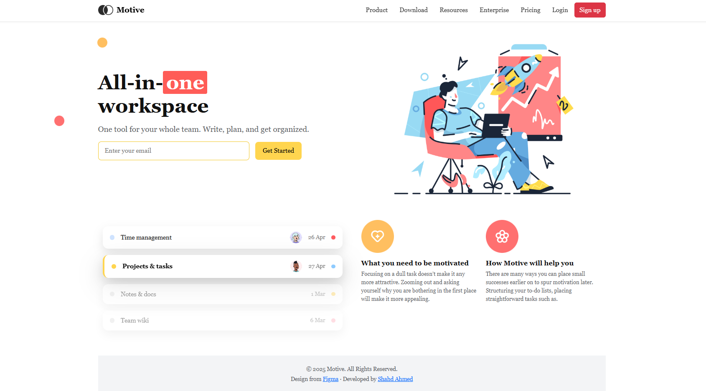

Motive Workspace — Landing Page

This is a simple and responsive **landing page** I built using **HTML, CSS, JavaScript, and Bootstrap 5** based on a public Figma design.  
I created this project to practice front-end development and turn a Figma design into a real, working page.

---
  🔗 Live Demo  
 [https://shahdahmed1.github.io/motive-workspace/](https://shahdahmed1.github.io/motive-workspace/)
---
 🎨 Original Design  
- Figma Design: [Workspace Landing Page](https://www.figma.com/community/file/1483084355146957997/workspace-landing-page)

---
 💡Features  
- Responsive design built with **Bootstrap 5**  
- Hero section with **email form** and validation  
- Local images/icons inside the `images/` folder  
- Basic SEO tags (`meta description`, `meta author`)  
- Clean, simple, and easy-to-edit code  

---

🗂️ File Structure  
 .
├── index.html

├── style.css

├── script.js

├── images/

├── README.md

├── LICENSE

└── .gitignore
  
---

🚀 Run Locally  

1. **Clone or download the repository**  
   ```bash
   git clone https://github.com/Shahdahmed1/motive-workspace.git
   cd motive-workspace


2.Open in your browser

Just open index.html directly.

✒️Optional: start a simple local server with Python:

python -m http.server 8000
# then go to http://localhost:8000

---

🌍 Deployment
Deploy to GitHub Pages

If you are starting from scratch:

git init
git add .
git commit -m "Initial commit"
git branch -M main
git remote add origin https://github.com/Shahdahmed1/motive-workspace.git
git push -u origin main


Then go to your repository on GitHub:

Settings → Pages

Under “Build and deployment,” choose Deploy from a branch

Branch: main + Folder: / (root) → Save

After a few seconds, your live demo link will appear.

Deploy to Netlify or Vercel

Link your GitHub repository to Netlify or Vercel for automatic deployment.

📨 Email Form

The form uses the following IDs: emailForm, emailInput, formMsg.
Make sure your HTML has this inside the Hero section:

<form id="emailForm" class="hero-form-separated mt-3">
  <input id="emailInput" type="email" placeholder="Enter your email" class="email-separated" required>
  <button class="btn-separated" type="submit">Get Started</button>
</form>
<p id="formMsg" class="mt-2"></p>

📝 Future Improvements

Add a favicon:

<link rel="icon" href="images/Frame.png" type="image/png">


Compress images for faster loading.

Add analytics or tracking (optional).

Improve SEO with Open Graph / Twitter Card tags.

 👩‍💻 About Me  

I’m Shahd Ahmed, a Software Tester with a keen interest in Front-End Development .I enjoy exploring how web applications work from both the quality assurance and the user interface side. This project is part of my learning journey to enhance my front-end skills and deliver better testing and user experiences.  

[LinkedIn](https://www.linkedin.com/in/shahd-ahmed-9ab142330/)
